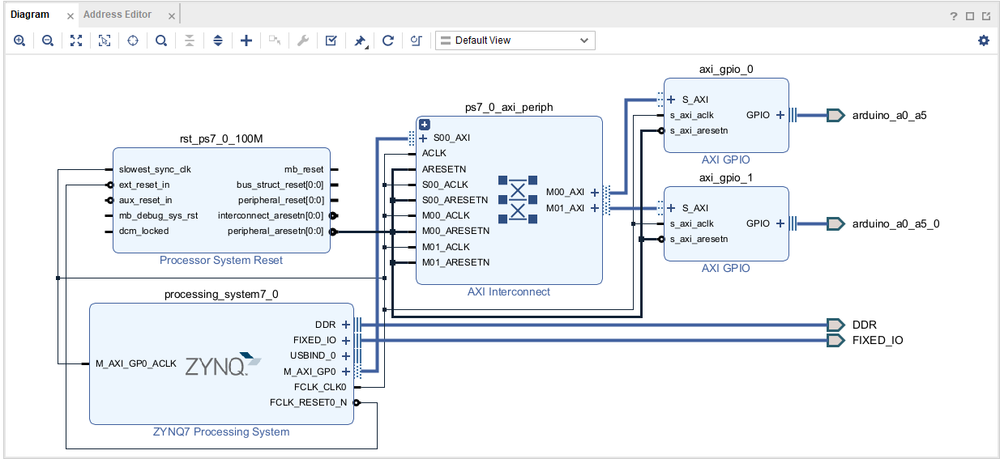
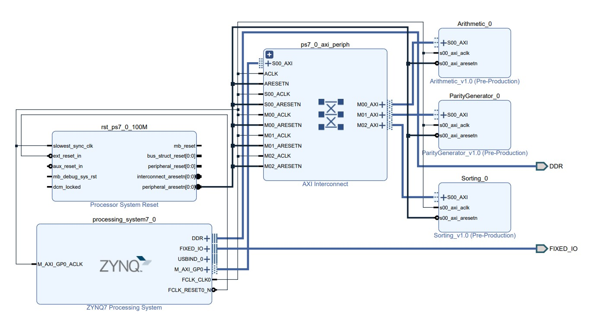
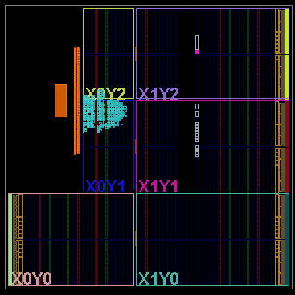
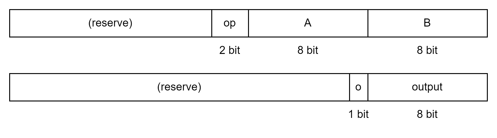
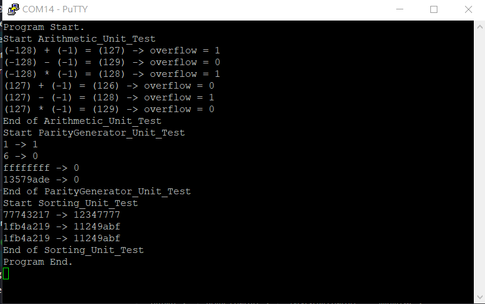

# 第五組 FPGA Design HW3 說明文件

## Basic Infomation

| 組員姓名 | 學號      |
| -------- | --------- |
| 蔣嘉寶   | E24096687 |
| 葉榮蒼   | E24094716 |
| 葉宣佑   | E24096695 |

## Problem1 – RGB LED(15%)

### Block Design Diagram

### 電路設計說明

這次作業在 PS 端透過軟體程式設定 PWM RBG 控制訊號。硬體端透過 vivado 提供的 AXI wrapper，我們並不需要實作 AXI protocol handshaking logic，在 PS 端則透過 driver API 將控制訊號透過 AXI bus 傳到 GPIO LED                                                                       

## Problem2 – Sorting(15%)
### Block Design Diagram

### 電路設計說明
- 使用c語言完成
- 使用Merge sort做排序，用sw判斷從大到小，還是從小到大，資料形態為int，支援32bit的資料

## Problem3(45%)
### Problem3-1 – Arithmetic(15%)
- 設計一個計算電路(加, 減, 乘)，由 processor 輸入運算子與運算元並回傳運算完的結果。
    - 資料寬度為 8 bit。
    - 需考慮有號數(正、負、overflow)。
### Problem3-2 – Sorting(15%)
- 設計一個排序電路，由 processor 輸入一串正整數將其排序後傳回。
    - 數字位元數自訂。(最少4bit)
    - 數列長度自訂且固定。(最少8筆數字)
- 需在作業說明中說明講解你們所使用的排序演算法、定義的數字位元數、數列長度。

### Problem3-3 – Parity Generator(15%)
- 設計parity generator，輸入 32-bit 資料回傳其parity bit。
    - 奇數個 1，回傳 1
    - 偶數個 1，回傳 0

### Block Design Diagram

### Implementation

### 電路設計說明
- Arithmetic
    - 設計了三個input資訊(運算元A、運算元B、運算子)以及兩個output port(運算結果、overflow指示)，並且將其掛接到AXI Bus上的兩個記憶體位置。
    
    - 內部設計相當於化簡過後的ALU。
- Sorting
    - 採用selection sort(與HW3-2的merge sort 不同)，並且善用硬體shift register 的特性完成sorting。
    - 由於計算需要一些時間，所以driver設計時需要以while loop作為檢查，確定記憶體讀值是正確的輸出結果(需要valid信號)。
    - 輸入:32bit(8個4bit數值，0~f)
    - 輸出:32bit(8個4bit數值，0~f)，由小到大排序。
    
-  Parity Generator
    - 硬體直接將輸入的32個wire進行xor運算即可。

- 針對不同的的硬體皆設有獨立的driver，並且在main.c中也有獨立的unit test供應體測試正確性。
### 測試結果
