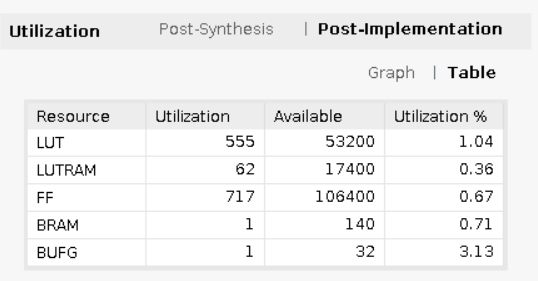

# 第五組 FPGA Design HW4 說明文件

## Basic Infomation

| 組員姓名 | 學號      |
| -------- | --------- |
| 蔣嘉寶   | E24096687 |
| 葉榮蒼   | E24094716 |
| 葉宣佑   | E24096695 |


## Problem 1 - Block RAM Utilize(60%)

### Block Design Diagram


### BRAM 電路設計說明
- BRAM Verilog Template configure
    - 如果使用 Output Register，雖然輸出的結果會有完整的一個cycle可以被讀取，但是output也會隨之晚一個cycle。因此我們傾向於不使用 Output Register。
    ```
    // DOA_REG, DOB_REG: Optional output register (0 or 1)
	.DOA_REG(0),
	.DOB_REG(0),
    ```
    - 依照題目說明將BRAM初始化成需要的Data。
    ```
    // INIT_00 to INIT_7F: Initial contents of the data memory array
	.INIT_00(256'h0000507100000000000000000000000000000000000000000000642500002597),
	.INIT_02(256'h0000000000000000000000000000000000000000000000000000000000008CF5),
    ```
    - 設定為題目要求的True Dual Port。
    ```
    // RAM Mode: "SDP" or "TDP"
	.RAM_MODE("TDP"),
    ```
    - 需要同時讀寫，所以所有寬度都要設成36 (32b data + 4b priority)。
    ```
    // READ_WIDTH_A/B, WRITE_WIDTH_A/B: Read/write width per port
	.READ_WIDTH_A(36), // 0-72
	.READ_WIDTH_B(36), // 0-36
	.WRITE_WIDTH_A(36), // 0-36
	.WRITE_WIDTH_B(36), // 0-72
    ```
    - 兩個port都設為 `WRITE_FIRST`。
    ```
    // WriteMode: Value on output upon a write ("WRITE_FIRST", "READ_FIRST", or "NO_CHANGE")
	.WRITE_MODE_A("WRITE_FIRST"),
	.WRITE_MODE_B("WRITE_FIRST")
    ```
- BRAM Verilog Template wire out
    - BRAM I/O
    ```
    module bram(
    input clkA,
    input clkB,

    input enA,
    input enB,

    input [3:0] wenA,
    input [3:0] wenB,

    input [31:0] data_inA,
    input [31:0] data_inB,

    input [14:0] addrA,
    input [14:0] addrB,

    output [31:0] data_outA,
    output [31:0] data_outB
    );
    ```
    - Data I/O for two port。
    ```
    .DOADO(data_outA), // 32-bit output: A port data/LSB data
    .DOBDO(data_outB), // 32-bit output: B port data/MSB data
    .DIADI(data_inA), // 32-bit input: A port data/LSB data
    .DIADI(data_inA), // 32-bit input: A port data/LSB data
    ```
    - Clock and enable / write enable。
    ```
    .CLKARDCLK(clkA), // 1-bit input: A port clock/Read clock
    .ENARDEN(enA), // 1-bit input: A port enable/Read enable
    .WEA(wenA), // 4-bit input: A port write enable
    .CLKBWRCLK(clkB), // 1-bit input: B port clock/Write clock
	.ENBWREN(enB), // 1-bit input: B port enable/Write enable
    .WEBWE({4'd0,wenB}), // 8-bit input: B port write enable/Write enable
    ```
    - BRAM 的 address 是 bitwise 的，所以如果要將以 Byte 為單位的 address 接上，需要 shift 3 bit 做修正。
    ```
    .ADDRARDADDR({1'b0,addrA[11:0],3'd0}), // 16-bit inp  ut: A port address/Read address
    .ADDRBWRADDR({1'b0,addrB[11:0],3'd0}), // 16-bit input: B port address/Write address
    ```


- BRAM Controller configure
    - Use AXILite4
    - Read Latency = 1， 在address給予後的下一個cycle便可以拿到Data。
    - Use two controller for true dual port R/W，分別掛載在 0x40000000 、 0x42000000 起始位址上。

### FPGA Utilization


### 測試結果
- 自行測試的 main.c

```c=
#include <stdio.h>
#include "xil_printf.h"
#include "xil_io.h"
#include "xparameters.h"

// reference "address editor" in vivado block design
#define XPAR_AXI_BRAM_CTRL_0_S_AXI_BASEADDR 0x40000000
#define XPAR_AXI_BRAM_CTRL_1_S_AXI_BASEADDR 0x42000000


int main()
{
    u32 a[4] = {0x1234, 0x5678, 0xdead, 0xbeef};
    u32 read, i, read2;
    // test initial value & port A read
    printf("Test initial value & port A read:\r\n");
    read = Xil_In32(XPAR_AXI_BRAM_CTRL_0_S_AXI_BASEADDR + 0);
    printf("[Port A: R] Offset =   0, Data = %x\r\n", read);
    read = Xil_In32(XPAR_AXI_BRAM_CTRL_0_S_AXI_BASEADDR + 4);
    printf("[Port A: R] Offset =   4, Data = %x\r\n", read);
    read = Xil_In32(XPAR_AXI_BRAM_CTRL_0_S_AXI_BASEADDR + 28);
    printf("[Port A: R] Offset =  28, Data = %x\r\n", read);
    read = Xil_In32(XPAR_AXI_BRAM_CTRL_0_S_AXI_BASEADDR + 64);
    printf("[Port A: R] Offset =  64, Data = %x\r\n", read);
    printf("===================\n");

    // test port A write
    printf("Test port A write:\r\n");
    for (i = 0; i < 4; i++) {
        read = Xil_In32(XPAR_AXI_BRAM_CTRL_0_S_AXI_BASEADDR + 4*i);
        printf("[Port A: W] Offset = %3d, Data = %x -> %x\r\n", 4*i, read, a[i]);
        Xil_Out32(XPAR_AXI_BRAM_CTRL_0_S_AXI_BASEADDR + 4*i, a[i]);
        printf("Check: MEM[%x] = %x\r\n", XPAR_AXI_BRAM_CTRL_0_S_AXI_BASEADDR + 4*i, Xil_In32(XPAR_AXI_BRAM_CTRL_0_S_AXI_BASEADDR + 4*i));
        printf("-------------------\n");
    }
    printf("===================\n");

    // test port B R/W
    printf("Test port B read & write:\r\n");
    for (i = 0; i < 20; i++) {
        read = Xil_In32(XPAR_AXI_BRAM_CTRL_0_S_AXI_BASEADDR + 4*(i+1));
        printf("[Port A: R] Offset = %3d, Data = %x\r\n", 4*(i+1), read);
        read2 = Xil_In32(XPAR_AXI_BRAM_CTRL_1_S_AXI_BASEADDR + 4*i);
        printf("[Port B: R] Offset = %3d, Data = %x\r\n", 4*i, read2);
        printf("[Port B: W] Offset = %3d, Data = %x -> %x\r\n", 4*i, read2, read);
        Xil_Out32(XPAR_AXI_BRAM_CTRL_1_S_AXI_BASEADDR + 4*i, read);
        printf("Check: MEM[%x] = %x\r\n", XPAR_AXI_BRAM_CTRL_1_S_AXI_BASEADDR + 4*i, Xil_In32(XPAR_AXI_BRAM_CTRL_1_S_AXI_BASEADDR + 4*i));
        printf("-------------------\n");
    }
    printf("===================\n");

    return 0;
}
```
- 測試結果


---
## Problem 2 - Q&A(30%)
1. PYNQ-Z2 上共有多少容量的Block RAM?
    - 根據AMD官方文件顯示，PYNQ-Z2 上Total Block RAM共有4.9Mb
或者由每個BRAM有36Kb的data+4bit parity，且有140個bram，所以(32+4)*140/1024 = 4.921875Mb
2. 承上題，共有多少個 RAMB36E1?
    - FPGA 板上共有 140 個 RAMB36E1。
3. 若要將 RAMB36E1 Configure 成 36Kb FIFO，該使用什麼 Verilog Template?
不用實作出來，但需將完整的Verilog Template以及其可改動的參數詳細說明(不必全部說明，至少說明15個)
    - 將 port A 作為輸出，port B 作為輸入
    - Verilog Template
    ```
    module (
        input clk,
        input rst,
        input ren, // read enable
        input [3:0] wen, // write enable
        input [31:0] data_in,
        output reg empty, full, // FIFO memory R/W enable
        output [31:0] data_out
        
    );
        reg [12:0] head, tail;
        
        // control head and tail
        always @(posedge clk or posedge rst) begin
            if (rst) begin
                head <= 13'd0;
                tail <= 13'd0;
            end
            else begin
                head <= (wen) ? head + 13'd1 : head;
                tail <= (ren) ? tail + 13'd1 : tail;
            end
        end
        
        // FIFO is empty cannot read
        always @(*) begin
            empty = !(head[12] ^ tail[12]) && (head[11:0] == tail[11:0]); 
            full = (head[12] ^ tail[12]) && (head[11:0] == tail[11:0]);
        end
        
        RAMB36E1 #(
        // Available Attributes
            .RAM_MODE("TDP"), // set as true dual port mode
            .DOA_REG(1), // set A port output register
            .READ_WIDTH_A(36), // A port read 32-bit data
            .WRITE_WIDTH_A(0), // A port cannot write
            .READ_WIDTH_B(0), // B port cannot read
            .WRITE_WIDTH_B(36) // B port write 32-bit data
        )
        RAMB36E1_inst (
        // Port Descriptions
            .CLKARDCLK(clk), // A, B synchronize
            .CLKBWRCLK(clk), // A, B synchronize

            .REGCEAREGCE(1'b1), // enable A port output register

            .ENARDEN(ren||!empty), 
            .WEA({~ren, ~ren, ~ren, ~ren}), // always not write

            .ENBWREN(wen>4'b0||!full), 
            .WEBWE({4'd0, wen}), // write 4 byte at once, write_enable = 0 is read

            .ADDRARDADDR({1'b0, head[11:0], 3'd0}), // read address
            .ADDRBWRADDR({1'b0, tail[11:0], 3'd0}), // write address

            .DOADO(data_out), // 32-bit data read out
            .DIBDI(data_in), // 32-bit data write in
        );

    endmodule
    ```